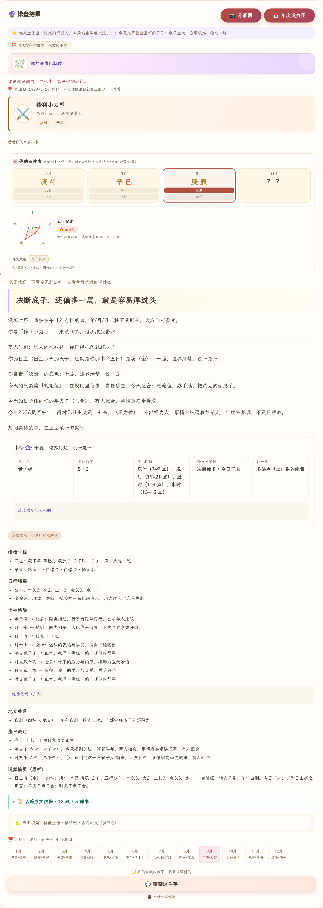

# 小满的解忧铺 🌾

> 一只毛绒绒的玄学搭子：每天拆一份「今日运势」礼物，能排八字、摇六爻、
> 翻黄历、合婚、五行起名、抽塔罗、看星座、解梦，随时找小满聊聊。

它不是又一个套壳聊天框。所有结果先由**确定性古典算法内核**算出
（47 部古籍、62,000+ 条语料单元做底：周易郑康成注、周易注疏、伊川易传、
太玄经、唐开元占经、宅经……），AI 只负责把算好的事实讲成温柔的大白话。
**事实层零幻觉，AI 层挂了产品照常可用。**

<p align="center">
  
  
</p>

线上实例：https://books-ctsw.onrender.com （私有部署，需口令进入）

## 核心设计：确定性骨架 + AI 血肉

```
你的生日 ──→ 规则引擎（排盘 / 冲合 / 十神 / 五行，全确定性可复现）
                │
                ├─→ 判词 / 宜忌 / 名单直接落屏 ── 永远有结果，零外部依赖
                │
                └─→ Atria-Dawn-Preview（首选）→ agnes → stepfun
                    并发竞速，谁先出稿用谁 ──→ 打字机逐字呈现
```

- **AI 不承重**：点评、润色、聊天全是增量层——LLM 全挂时每个功能都有
  确定性底稿（起名的「典故先读」卡、判词原始事实句），失败给真实
  重试入口而非死胡同。
- **个性化是真的**：存了生日，日签会叠「你的日主 × 今天」十神行 +
  「对你：小凶 / 岁合 / 轻冲…」日支冲合个人判词——同一天不同人开出
  不一样的签。
- **移动优先 PWA**：Service Worker 离线壳、暗色模式、焦点陷阱、
  aria-live 播报、尊重 `prefers-reduced-motion`。

## 功能地图

| 模块 | 说明 |
|---|---|
| 🎁 每日礼物 | 封面仪式 + 通版判词（黄历口径）+ 存生日后个人层 |
| ☯️ 八字排盘 | 四柱 / 十神 / 五行 / 大运，古籍引文可核验到原文锚点 |
| 🪙 六爻 | 起卦 / 应期 / 月建旬空，64 卦白话 + 经文出处 |
| 📅 黄历 | 宜忌 / 吉神凶煞 / 星宿 / 节气，「问一嘴」自然语言问事 |
| 💞 合婚 | 双人排盘 + 邀请链（对方点开自动回填 + 防覆盖） |
| 🌸 起名 | 四风格 × 五行补缺，AI 古籍典故点评（确定性底卡托底） |
| 🃏 塔罗 | 多牌阵 + 确定性种子回放（分享链接逐字一致） |
| ⭐ 星座 | 十二宫日运 + 速配 |
| 🌙 解梦 | 意象词典 + 心理学取向解读（不宿命化） |
| 💬 小满聊天 | 记住你的盘和测过的卡，跨日记忆进上下文 |

## 快速开始

环境要求：Python 3.11+。不需要装数据库，SQLite 是自带的。

```bash
# 1. 装依赖
python3 -m venv .venv && .venv/bin/pip install -r requirements-runtime.txt

# 2. 建语料索引（首次约 10 秒，产物在 data/index/，不进仓库）
.venv/bin/python scripts/check_quality.py && .venv/bin/python scripts/build_index.py

# 3. 起服务
.venv/bin/python -m uvicorn web.app:app --port 8123 --no-access-log
```

打开 http://127.0.0.1:8123 —— 首页填个生日就能拆今天的礼物。

前端改了 `web/static/` 直接生效。注意这是 PWA：Service Worker 会
缓存旧壳，改完硬刷一次（Ctrl/Cmd+Shift+R），或点页面弹出的
「有更新」提示。

## 启用小满聊天（可选）

不配 key，所有确定性功能照常能用。要 AI 层（小满聊天、起名典故
点评、判词润色）：

**本地**——建 `web/llm_config.json`（gitignored），OpenAI 兼容格式：

```json
{
  "api_key": "sk-…",
  "base_url": "https://…/v1",
  "model": "模型名",
  "timeout_s": 24,
  "max_tokens": 1600,
  "fallbacks": [
    {"api_key": "…", "base_url": "…", "model": "…"}
  ]
}
```

`fallbacks` 里可以再挂多家提供方——所有节点并发竞速，谁先出稿
用谁；全挂时功能降级到确定性底稿，不会空白。

**部署**——Render/HF 等没有配置文件的地方，把上面整份 JSON 原样
粘到环境变量 `BOOKS_LLM_CONFIG_JSON`。离散 `BOOKS_LLM_API_KEY`
系列只够配单节点，而且会覆盖 JSON 里主节点的 key——两者选一个，
建议只用 JSON。

完整环境变量表、Render 步骤、调优经验：[docs/DEPLOY.md](docs/DEPLOY.md)。

## 跑测试

```bash
# 测试依赖（playwright + 探针要用的包）
.venv/bin/pip install -r requirements-ci.txt playwright==1.63.0
.venv/bin/python -m playwright install chromium

# selftest 需要一个非空的 knowledge.db——幂等种子，跑一次即可
.venv/bin/python - <<'PY'
import sys; sys.path.insert(0, '.'); sys.path.insert(0, 'src')
from guji.knowledge import KnowledgeBase, Evidence
kb = KnowledgeBase('data/index/knowledge.db')
if kb.db.execute("SELECT count(*) c FROM thread").fetchone()["c"] == 0:
    tid = kb.open_thread('env-seed: 本地环境种子线程')
    kb.add_turn(tid, 'user', '环境自检种子')
else:
    tid = kb.db.execute("SELECT id FROM thread ORDER BY id LIMIT 1").fetchone()["id"]
if kb.db.execute("SELECT count(*) c FROM derived").fetchone()["c"] == 0:
    kb.record('summary', '天下之至柔，驰骋于天下之至坚', 'env-seed',
              evidence=[Evidence(work_id='KR5c0057', file='KR5c0057_043.txt',
                                 raw_start=6918, raw_end=6994,
                                 quote='第四十三章 天下之至柔',
                                 page_anchor='KR5c0057_tls_043-1a')],
              thread_id=tid)
kb.close()
PY

# 三道主闸门
BOOKS_LLM_DISABLE=1 .venv/bin/python web/selftest.py            # 375 项自检
BOOKS_LLM_DISABLE=1 .venv/bin/python probes/probe_ui_smoke.py   # 91 例真浏览器冒烟
BOOKS_LLM_DISABLE=1 .venv/bin/python probes/probe_contract.py   # 726 个契约读点
```

`probes/` 下还有字节冻结基线、日期词前后端同构、`$` 误用等专项
探针，完整清单见 [docs/DEPLOY.md](docs/DEPLOY.md)。

`data/external/bge-small-zh-v1.5` 的语义模型权重在 Git LFS 里——跑
检索类闸门前先 `git lfs pull`；web 主路径不依赖它，没拉也能正常用。

## 结构速览

| 目录 | 职责 |
|---|---|
| `src/guji/` | 语料解析 + 命理计算核心（零 web 依赖，可脱离服务单测） |
| `web/` | FastAPI：`routers/` 薄路由 → `services.py` 编排 → guji 内核 |
| `web/static/` | 单页前端 + PWA（原生 JS，无框架） |
| `probes/` | 回归探针（`archive/` 是已完成使命的一次性探针） |
| `data/` | 原始语料；`data/index/*.db` 为可重建产物（gitignored） |
| `scripts/` `docs/` | 索引构建与数据闸门 · 架构 / 决策 / 运维文档 |

## 说明

本项目仅作文化与技术探索：所有解读均为固定规则产出或 AI 转述，
不构成人生建议。部署与运维细节见 [docs/DEPLOY.md](docs/DEPLOY.md)。
