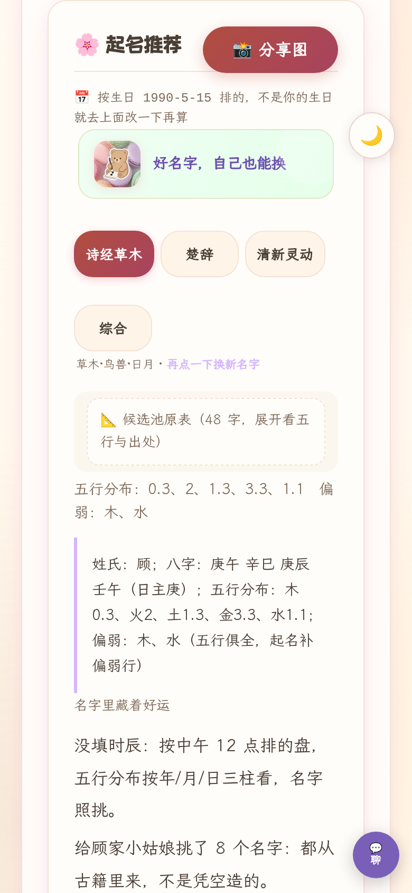
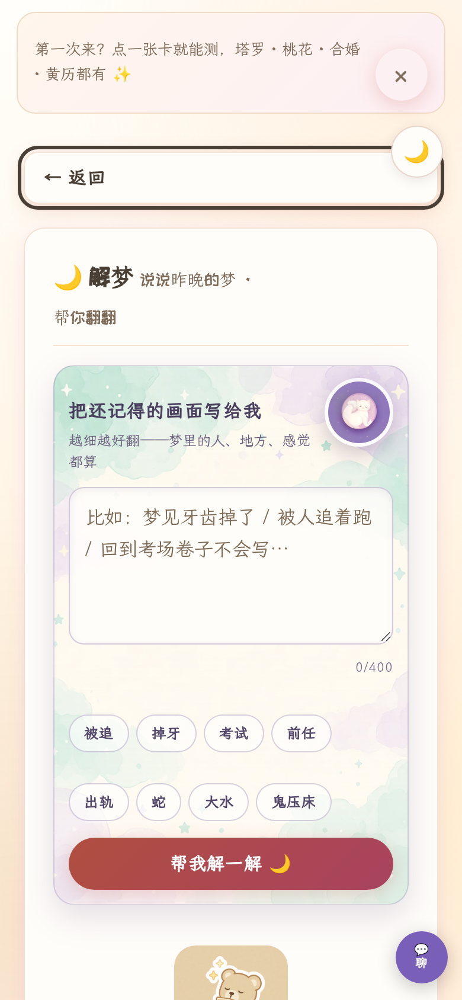

# 小满的解忧铺 🌾

**一只毛绒绒的玄学搭子**：每天拆一份「今日运势」礼物，可以排八字、摇六爻、
翻黄历、合婚、五行起名、抽塔罗、看星座、解梦，随时找小满聊聊。

不一样的地方在于——它不是又一个套壳聊天框。所有结果先由**确定性古典算法
内核**算出（本地 47 部古籍、62,000+ 条语料单元支撑：周易郑康成注、周易注疏、
伊川易传、太玄经、唐开元占经、宅经……），AI 只负责把算好的事实用温柔的话
讲给你听。**事实层零幻觉，AI 层挂了产品照常可用。**

<p align="center">
  
  
  
</p>
<p align="center">
  
</p>

## 核心设计：确定性骨架 + AI 血肉

```
你的生日 ──→ 规则引擎（排盘/冲合/十神/五行，全确定性可复现）
                │
                ├─→ 判词/宜忌/名单直接落屏 ──── 永远有结果，零依赖
                │
                └─→ Atria-Dawn-Preview（首选）
                    → agnes → stepfun  ──── 并发竞速，谁先出稿用谁
                          │
                          └─→ 把事实讲成故事，打字机逐字呈现
```

- **AI 不承重**：点评、润色、聊天全部 additive——LLM 全挂时每个功能
  都有确定性底稿（起名的「典故先读」卡、判词的原始事实句），失败时
  留真实重试入口而非死胡同。
- **个性化是真的**：存了生日后，日签会叠加「你的日主 × 今天」十神行 +
  「对你：小凶/岁合/轻冲…」日支冲合个人判词——同一天不同人开出不
  一样的签。
- **移动优先 PWA**：Service Worker 离线壳、暗色模式、焦点陷阱、
  aria-live 播报、`prefers-reduced-motion` 尊重。

## 功能地图

| 模块 | 说明 |
|---|---|
| 🎁 每日礼物 | 封面仪式 + 通版判词（黄历口径）+ 存生日后个人层 |
| ☯️ 八字排盘 | 四柱/十神/五行/大运，古籍引文可核验到人名版锚点 |
| 🪙 六爻 | 起卦/应期/月建旬空，64 卦白话 + 经文出处 |
| 📅 黄历 | 宜忌/吉神凶煞/星宿/节气，「问一嘴」自然语言问事 |
| 💞 合婚 | 双人排盘 + 邀请链（对方点开自动回填+防覆盖） |
| 🌸 起名 | 四风格（诗经草木/楚辞/清新灵动/综合）× 五行补缺，AI 典故点评 |
| 🃏 塔罗 | 多牌阵 + 确定性种子回放（分享链接逐字一致） |
| ⭐ 星座 | 十二宫日运 + 速配 |
| 🌙 解梦 | 意象词典 + 心理学取向解读（不宿命化） |
| 💬 小满聊天 | 记住你的盘和测过的卡，跨日记忆进上下文 |

## 工程底线（为什么它敢自称"可靠"）

- **375 项自检**（`web/selftest.py`）：算法正确性、降级路径、安全闸逐条钉死
- **726 个契约读点**（`probe_contract.py`）：前端读的每个 API 字段都真实存在
- **91 例浏览器冒烟**（`probe_ui_smoke.py`）：真 Chromium 走用户路径
- 字节冻结基线 / 日期词前后端同构 / dict 重复键静态闸 / `$` 误用探针
- 幂等导入、任务双帽、限速哨兵、危机消息免配额直返转介文案

## 跑起来（本地）

```bash
python3 -m venv .venv
.venv/bin/pip install -r requirements-runtime.txt
.venv/bin/pip install "torch==2.14.0+cpu" --find-links https://mirrors.aliyun.com/pytorch-wheels/cpu/
.venv/bin/pip install -r requirements-ci.txt playwright==1.63.0
.venv/bin/python -m playwright install chromium

# 语料索引（data/index/corpus.db，gitignored，实测重建 ~10 秒，约 55MB）
.venv/bin/python scripts/check_quality.py
.venv/bin/python scripts/build_index.py

# knowledge.db 种子：selftest 的 threads.detail/share.bazi 需要线程 id=1
# 与一条带证据的 derived——首次建库后跑一次（幂等，已有数据则跳过）。
.venv/bin/python - <<'PY'
import sys
sys.path.insert(0, '.'); sys.path.insert(0, 'src')
from guji.knowledge import KnowledgeBase, Evidence
kb = KnowledgeBase('data/index/knowledge.db')
if kb.db.execute("SELECT count(*) c FROM thread").fetchone()["c"] == 0:
    tid = kb.open_thread('env-seed: 本地环境种子线程')
    kb.add_turn(tid, 'user', '环境自检种子')
else:
    tid = kb.db.execute("SELECT id FROM thread ORDER BY id LIMIT 1").fetchone()["id"]
if kb.db.execute("SELECT count(*) c FROM derived").fetchone()["c"] == 0:
    kb.record('summary', '天下之至柔，驰骋于天下之至坚', 'env-seed',
              evidence=[Evidence(work_id='KR5c0057', file='KR5c0057_043.txt',
                                 raw_start=6918, raw_end=6994,
                                 quote='第四十三章 天下之至柔',
                                 page_anchor='KR5c0057_tls_043-1a')],
              thread_id=tid)
kb.close()
PY
```

> **前置：git lfs**——`data/external/bge-small-zh-v1.5` 的模型权重在 LFS
> 里。clone 后跑 `git lfs pull`；没拉的话 `bazi.semantic` 闸门与
> `scripts/ask_bazi.py --sem` 会拿到指针文件直接挂（web 主路径不走语义
> 检索，不受影响）。

```bash
.venv/bin/python -m uvicorn web.app:app --port 8123 --no-access-log
# 打开 http://127.0.0.1:8123
# （uvicorn access log 会把 ?bday=/邀请链等含生辰的 query 写进 stdout——
#   对外部署/反代场景务必关掉）
```

**TLS 反代后部署**（nginx/Caddy/网关终结 HTTPS）：务必加
`--proxy-headers --forwarded-allow-ips <反代网段>`——og:image/og:url 的绝对
URL 按 `request.base_url` 生成，不开 proxy-headers 会落成 `http://` 内网
地址，微信/推特种爬虫静默抓不到卡片图，且无任何报错面（R2350b / R99-P2）。

Windows 桌面一键入口：`web_launcher.py` / `start_web.bat`（自拉起服务、开浏览器、
关浏览器自动停服务）。

## LLM 陪伴层（可选）

不配 key 也能用**全部**确定性功能——AI 是纯增量层。要小满开口：

1. 建 `web/llm_config.json`（gitignored），OpenAI 兼容端点格式；
   或用环境变量覆盖（key 不落盘）。
2. 支持 `fallbacks` 兜底链——本项目实测经验：推理型模型（Atria/StepFun）
   `max_tokens` 要给足 1600+，否则思考烧穿预算返回空泡；
   点评类任务并发竞速比串行兜底在拥挤期成功率高得多。

### 环境变量开关表

| 变量 | 取值 | 语义 | 默认 |
|---|---|---|---|
| `BOOKS_LLM_API_KEY` | key 字符串 | LLM key（替代配置文件） | 读 `web/llm_config.json` |
| `BOOKS_LLM_BASE_URL` | `https://…/v1` | LLM 端点 | 配置文件/内置默认 |
| `BOOKS_LLM_MODEL` | 模型名 | LLM 模型 | `agnes-2.5-flash` |
| `BOOKS_LLM_TIMEOUT_S` | 秒数 | LLM 超时 | `30` |
| `BOOKS_LLM_MAX_TOKENS` | 整数 | LLM token 上限 | `1000` |
| `BOOKS_LLM_DISABLE` | `1/on/true/yes` | 强制离线（所有 AI 层关掉） | 关 |
| `BOOKS_PAIPAN_HISTORY_DISABLE` | `1/on/true/yes` | 关排盘台账（隐私部署用） | 关 |
| `BOOKS_WRITE_DISABLE` | `1/on/true/yes` | 共享 knowledge.db 写面拒绝（公网演示） | 关 |
| `BOOKS_EXTERNAL_DISABLE` | `1/on/true/yes` | 关 external/* 外部资讯拉取 | 关 |
| `BOOKS_ALLOWED_HOSTS` | 逗号分隔域名 | TrustedHost 白名单（防 Host 投毒） | 放行全部 |
| `BOOKS_CORS_ORIGINS` | 逗号分隔 Origin | 分体部署的跨域白名单 | 不加 CORS 头 |
| `BOOKS_ACCESS_TOKEN` | 口令字符串 | 访问闸：页面输一次口令写 Cookie 30 天（公网部署必配） | 不设=全开放 |
| `BOOKS_TRUST_XFF` | `1/on/true/yes` | 限速桶信任 X-Forwarded-For 尾跳（仅受信代理部署开） | 关 |
| `GUJI_PROXY` | `http://…` | external 抓取出网代理 | 直连 |

exe 形态：`llm_config.json` 放在 exe 同目录（或 exe 旁 `web/` 下）即可被读到；
exe 旁还必须放 `data/index/corpus.db`（缺了古籍相关端点会 503）。

## 公网部署（Railway/Render/Fly.io/Docker）

仓库自带 `Dockerfile` + `requirements-runtime.txt` + `.python-version`：

```bash
docker build -t books . && docker run -p 8123:8123 books
# 平台形态：装 requirements-runtime.txt，启动命令
uvicorn web.app:app --host 0.0.0.0 --port ${PORT:-7860} \
  --proxy-headers --forwarded-allow-ips '*' --no-access-log --workers 1
```

**只给自己看的私有站**——设了它整站带钥匙才进，没钥匙只见
「输口令」的门；不设则全开（本地单用户默认）：

```bash
BOOKS_ACCESS_TOKEN=你自己的口令     # 页面输一次口令写 Cookie 30 天；
                                    # 或带 ?key=口令 的链接直通
# /api/health 豁免（平台探活要用）。Render 免费档步骤：
#   1. render.com 注册 → New → Web Service → 连本仓库 → Runtime 选 Docker
#   2. Instance type 选 Free；环境变量加 BOOKS_ACCESS_TOKEN
#     和 BOOKS_LLM_API_KEY（小满聊天要）
#   3. Deploy → 几分钟后 https://<名字>.onrender.com 开门输口令即进
#   免费档 15 分钟无请求休眠、冷启动 ~30s；要常驻升 Starter。
```

**多访客公开站必须开的环境变量**（这站按本地单用户设计——排盘台账
自动记生辰，knowledge.db 全部共享）：

```bash
BOOKS_PAIPAN_HISTORY_DISABLE=1   # 排盘台账整体关闭（否则所有人生日互见互删）
BOOKS_WRITE_DISABLE=1            # 共享库写面拒绝（prefs/favorites/threads/import）
BOOKS_EXTERNAL_DISABLE=1         # 服务器上没 GUJI_PROXY 时关 RSS 外呼
# 公网演示还建议 BOOKS_LLM_DISABLE=1 或 BOOKS_ACCESS_TOKEN——
# 否则匿名访客可消耗 LLM 配额（虽有 120/min 全局限速+12 在途帽兜底）。
BOOKS_LLM_DISABLE=1              # 没配 LLM 凭据/不想给访客烧额度时开
```

- **不要装 `requirements-ci.txt`**——里面的 sentence-transformers 会拖
  torch ~2GB，免费档直接炸；运行时只需 `requirements-runtime.txt`。
- **必须单实例单 worker**（`--workers 1`）：限流/AI 任务/聊天会话全在
  进程内存里，多 worker 下任务会 404。
- 数据不持久：paipan_history.db / knowledge.db 写在容器盘，免费档重启
  即清零（要留存就挂卷到 `data/`）。
- 建索引是构建期步骤（Dockerfile 已固化 `build_index.py`）；缺
  `data/index/corpus.db` 时古籍端点返回 503 但站点其余功能正常。
- 部署后健康检查指 `GET /api/health`（返回 `engine` + `index` 就位标志）。

## 闸门（全部须 PASS）

```bash
BOOKS_LLM_DISABLE=1 .venv/bin/python web/selftest.py            # 主闸门（当前 375 项，以 selftest 末行输出为准）
BOOKS_LLM_DISABLE=1 .venv/bin/python probes/probe_contract.py   # 契约（当前 726 读点，以末行为准）
BOOKS_LLM_DISABLE=1 .venv/bin/python probes/probe_ui_smoke.py   # 浏览器冒烟（当前 91 用例，以末行为准）
BOOKS_LLM_DISABLE=1 .venv/bin/python probes/probe_baseline.py   # 专业模式字节冻结基线（baseline_voice 包装）
BOOKS_LLM_DISABLE=1 .venv/bin/python probes/probe_standing.py   # 常驻离线闸（warm_voice/xingzuo/async_ai 三件套）
BOOKS_LLM_DISABLE=1 .venv/bin/python probes/probe_date_parity.py   # 前后端日期词/别名同构
.venv/bin/python probes/probe_dollar_misuse.py                  # 静态探针
.venv/bin/python probes/probe_selftest_regress.py               # 断言只增不减
BOOKS_LLM_DISABLE=1 .venv/bin/python probes/probe_first_screen.py  # 首屏抵达成本
.venv/bin/python probes/probe_chat_e2e.py                        # chat 全链（进程内 mock LLM，勿加 DISABLE）
.venv/bin/python probes/probe_dup_keys.py                        # dict 字面量重复键静态闸
```

CI（`.github/workflows/selftest.yml`）在 push/PR 上自动跑以上全部 + corpus 数据闸门
（check_booksec / check_dual_engine / check_provenance / verify_index / assess_goals） + baseline_voice/probe_llm_polish/check_xingzuo/check_warm_voice/check_async_ai/check_plain_first/check_poster/ruff——完整闸集以 `.github/workflows/selftest.yml` 为准。

## 结构

- `src/guji/` — 语料解析与命理计算核心（无任何 web 依赖）
- `web/` — FastAPI 应用（`routers/` 薄路由 → `services.py` → `src/guji/`）
- `web/static/` — 单页前端（app.js / styles.css / index.html + PWA）
- `scripts/` — 索引构建、质量与数据闸门（13 道）
- `probes/` — 回归探针；`probes/archive/` 是已完成使命的一次性探针
- `data/` — 原始语料与外部资源；`data/index/*.db` 均为可重建产物（gitignored）
- `specs/`、`.specify/` — 功能规格与治理宪法；`delivery/` — 交付物
- `books_app.spec`、`web_launcher.py`、`start_web.bat` — exe 打包与双击启动
- `requirements-ci.txt` / `requirements-packaging.txt` — CI 与打包依赖钉扎
- `docs/` — 架构/决策/台账（`TASK_LEDGER.md` 按 §追加，每行带可复验命令）

> 历史文档/台账里引用的 `probes/*.py` 若报不存在——多数已归档到
> `probes/archive/`，先查那里（R27-#1）。

## 红线（改代码前先看）

宪法三条 + 派生纪律都写在 `docs/`：所有状态声明必须带可复验命令；引文可核验
（折叠 ≠ 删除）；语料不做远端抓取；前端数据一律 `esc()`/`renderRichText`
/`fmtScalar` 渲染，`innerHTML` 不许插未转义数据；LLM 只润色不承重，必须能静默降级。

---

*本项目仅作文化与技术探索——所有解读均为固定规则产出或 AI 转述，不构成人生建议。*
